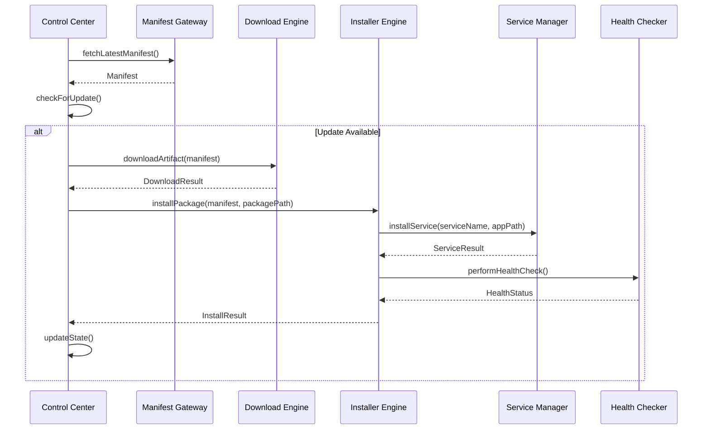
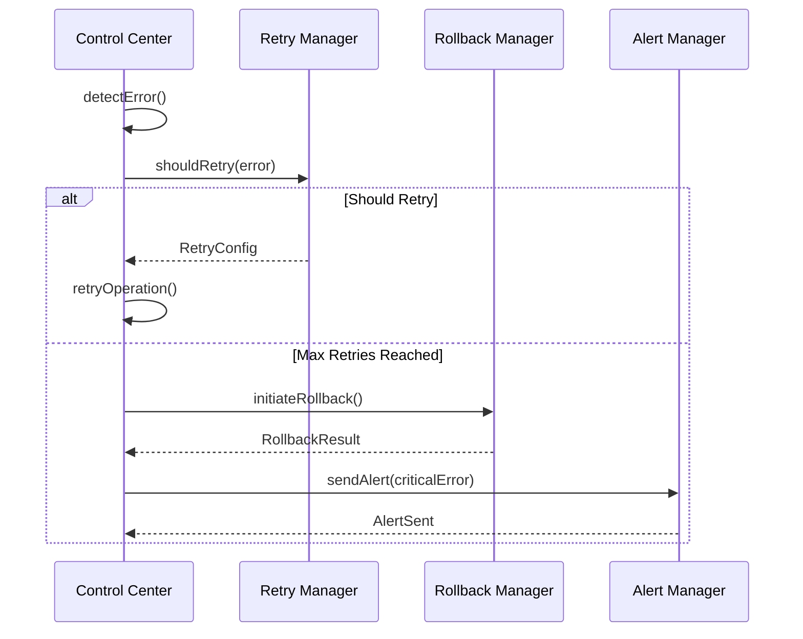
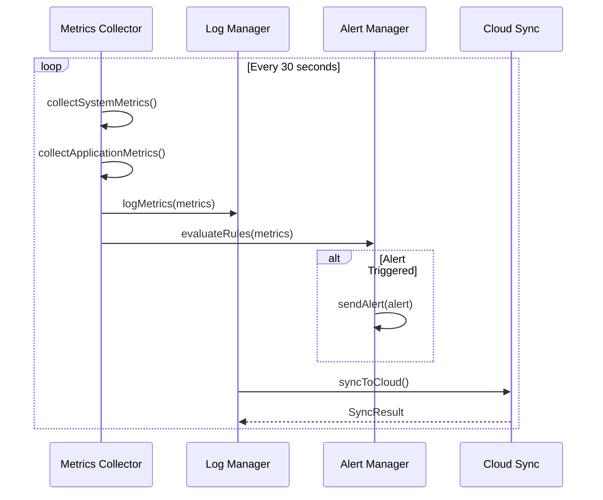

# Enterprise-Level Low-Level Design (LLD) for Installer Application

## Table of Contents
1. [Architecture Overview](#architecture-overview)
2. [Design Patterns](#design-patterns)
3. [Core Components](#core-components)
4. [Class Hierarchy](#class-hierarchy)
5. [Detailed Class Definitions](#detailed-class-definitions)
6. [Process Flows](#process-flows)
7. [Event System](#event-system)
8. [Error Handling & Recovery](#error-handling--recovery)
9. [Security & Authentication](#security--authentication)
10. [Monitoring & Logging](#monitoring--logging)
11. [Deployment Strategy](#deployment-strategy)

---

## Architecture Overview

### High-Level Architecture
```
┌─────────────────────────────────────────────────────────────────┐
│                        CDN Layer                                │
├─────────────────────────────────────────────────────────────────┤
│  Manifest Gateway    │    Artifact Gateway    │   Auth Gateway  │
│  - Version Control   │    - Package Storage   │   - JWT/OAuth   │
│  - Checksum Verify   │    - CDN Distribution  │   - Token Mgmt  │
│  - Metadata Mgmt     │    - Rate Limiting     │   - Expiry      │
└─────────────────────────────────────────────────────────────────┘
                                │
                                ▼
┌─────────────────────────────────────────────────────────────────┐
│                    Edge Layer (Port 3000)                      │
├─────────────────────────────────────────────────────────────────┤
│  Control Center     │    Downloader        │    Installer      │
│  - Orchestration    │    - Artifact Fetch  │    - Package Deploy│
│  - State Mgmt       │    - Checksum Verify │    - Service Mgmt  │
│  - Event Handling   │    - Retry Logic     │    - Health Check  │
├─────────────────────────────────────────────────────────────────┤
│  Monitoring         │    Logger            │    Retry Manager  │
│  - Metrics Collect  │    - Log Rotation    │    - Backoff      │
│  - Health Check     │    - Cloud Sync      │    - Circuit Brk  │
│  - Alert System     │    - Compression     │    - Timeout      │
└─────────────────────────────────────────────────────────────────┘
```

---

## Design Patterns

### 1. **Strategy Pattern** - Download Strategies
- `IDownloadStrategy` interface
- `HttpDownloadStrategy`, `FtpDownloadStrategy`, `SftpDownloadStrategy`
- `ManifestDownloadStrategy`, `ArtifactDownloadStrategy`

### 2. **Factory Pattern** - Service Creation
- `ServiceFactory` for creating platform-specific services
- `DownloaderFactory` for different download types
- `InstallerFactory` for OS-specific installers

### 3. **Observer Pattern** - Event System
- `IEventPublisher` and `IEventSubscriber` interfaces
- Event-driven architecture for loose coupling
- Real-time notifications and status updates

### 4. **Command Pattern** - Operations
- `ICommand` interface for all operations
- `DownloadCommand`, `InstallCommand`, `RollbackCommand`
- Undo/Redo capabilities and operation queuing

### 5. **Builder Pattern** - Complex Objects
- `ManifestBuilder` for manifest construction
- `DownloadConfigBuilder` for configuration
- `ServiceConfigBuilder` for service setup

### 6. **Singleton Pattern** - Core Services
- `ControlCenter` as central orchestrator
- `EventBus` for global event management
- `ConfigurationManager` for app settings

### 7. **Adapter Pattern** - External Integrations
- `AzureEventHubAdapter` for cloud events
- `DatabaseAdapter` for different database types
- `CloudStorageAdapter` for various cloud providers

### 8. **Decorator Pattern** - Enhanced Functionality
- `RetryableDownloader` decorates base downloader
- `LoggingService` decorates core services
- `MetricsCollector` decorates monitoring services

---

## Core Components

### 1. **Manifest Management System**
- **ManifestGateway**: Handles manifest fetching and authentication
- **ManifestValidator**: Validates manifest integrity and signatures
- **ManifestCache**: Local caching with TTL and invalidation
- **VersionComparator**: Semantic version comparison and update detection

### 2. **Download Management System**
- **DownloaderEngine**: Core download orchestration
- **ChecksumVerifier**: File integrity verification
- **RateLimiter**: Download rate control and throttling
- **ProgressTracker**: Real-time download progress monitoring

### 3. **Installation Management System**
- **InstallerEngine**: Core installation orchestration
- **ServiceManager**: OS-specific service management
- **HealthChecker**: Application health monitoring
- **RollbackManager**: Safe rollback mechanisms

### 4. **Monitoring & Logging System**
- **MetricsCollector**: System and application metrics
- **LogManager**: Centralized logging with rotation
- **AlertManager**: Threshold-based alerting
- **CloudSyncManager**: Log and metrics cloud synchronization

### 5. **Control & Orchestration System**
- **ControlCenter**: Central orchestration hub
- **StateManager**: Application state persistence
- **EventBus**: Inter-component communication
- **ConfigurationManager**: Dynamic configuration management

---

## Class Hierarchy

### Abstract Base Classes

```typescript
// Base Service Interface
interface IService {
  initialize(): Promise<void>;
  shutdown(): Promise<void>;
  getStatus(): ServiceStatus;
}

// Base Downloader Interface
abstract class BaseDownloader implements IService {
  protected retryHandler: IRetryHandler;
  protected eventPublisher: IEventPublisher;
  protected logger: ILogger;
  
  abstract download(url: string, destination: string): Promise<DownloadResult>;
  abstract verifyChecksum(filePath: string, expectedChecksum: string): Promise<boolean>;
}

// Base Installer Interface
abstract class BaseInstaller implements IService {
  protected serviceManager: IServiceManager;
  protected healthChecker: IHealthChecker;
  protected rollbackManager: IRollbackManager;
  
  abstract install(packagePath: string, targetPath: string): Promise<InstallResult>;
  abstract uninstall(serviceName: string): Promise<UninstallResult>;
  abstract rollback(previousVersion: string): Promise<RollbackResult>;
}

// Base Monitor Interface
abstract class BaseMonitor implements IService {
  protected metricsCollector: IMetricsCollector;
  protected alertManager: IAlertManager;
  
  abstract collectMetrics(): Promise<MetricsData>;
  abstract checkHealth(): Promise<HealthStatus>;
  abstract sendHeartbeat(): Promise<void>;
}
```

### Concrete Implementations

```typescript
// HTTP Downloader
class HttpDownloader extends BaseDownloader {
  private httpClient: IHttpClient;
  private rateLimiter: IRateLimiter;
  
  async download(url: string, destination: string): Promise<DownloadResult> {
    // Implementation with HTTP client
  }
}

// Windows Service Installer
class WindowsServiceInstaller extends BaseInstaller {
  private nssmService: INssmService;
  private registryManager: IRegistryManager;
  
  async install(packagePath: string, targetPath: string): Promise<InstallResult> {
    // Windows-specific installation logic
  }
}

// System Monitor
class SystemMonitor extends BaseMonitor {
  private osUtils: IOSUtils;
  private processMonitor: IProcessMonitor;
  
  async collectMetrics(): Promise<MetricsData> {
    // System metrics collection
  }
}
```

---

## Detailed Class Definitions

### 1. Manifest Management Classes

```typescript
// Manifest Gateway
class ManifestGateway implements IManifestGateway {
  private authManager: IAuthManager;
  private httpClient: IHttpClient;
  private cache: IManifestCache;
  
  constructor(
    private config: ManifestConfig,
    private eventBus: IEventBus
  ) {}
  
  async fetchLatestManifest(): Promise<Manifest> {
    // Fetch from CDN with authentication
  }
  
  async validateManifest(manifest: Manifest): Promise<ValidationResult> {
    // Validate signature and integrity
  }
  
  async refreshAuthToken(): Promise<void> {
    // Refresh authentication token
  }
}

// Manifest Validator
class ManifestValidator implements IManifestValidator {
  private signatureVerifier: ISignatureVerifier;
  private checksumVerifier: IChecksumVerifier;
  
  async validate(manifest: Manifest): Promise<ValidationResult> {
    // Comprehensive manifest validation
  }
  
  async verifySignature(manifest: Manifest): Promise<boolean> {
    // Digital signature verification
  }
}

// Version Comparator
class VersionComparator implements IVersionComparator {
  compareVersions(version1: string, version2: string): ComparisonResult {
    // Semantic version comparison
  }
  
  isUpdateAvailable(current: string, latest: string): boolean {
    // Check if update is available
  }
  
  getUpdateType(current: string, latest: string): UpdateType {
    // Determine update type (major, minor, patch)
  }
}
```

### 2. Download Management Classes

```typescript
// Download Engine
class DownloadEngine implements IDownloadEngine {
  private downloaders: Map<DownloadType, IDownloader>;
  private progressTracker: IProgressTracker;
  private rateLimiter: IRateLimiter;
  
  constructor(
    private config: DownloadConfig,
    private eventBus: IEventBus
  ) {
    this.initializeDownloaders();
  }
  
  async downloadArtifact(manifest: Manifest): Promise<DownloadResult> {
    // Orchestrate download process
  }
  
  private initializeDownloaders(): void {
    // Initialize different download strategies
  }
}

// Checksum Verifier
class ChecksumVerifier implements IChecksumVerifier {
  private supportedAlgorithms: string[];
  
  async verify(filePath: string, expectedChecksum: string, algorithm: string): Promise<boolean> {
    // Verify file checksum
  }
  
  async calculate(filePath: string, algorithm: string): Promise<string> {
    // Calculate file checksum
  }
}

// Rate Limiter
class RateLimiter implements IRateLimiter {
  private tokenBucket: ITokenBucket;
  private config: RateLimitConfig;
  
  async acquireToken(): Promise<boolean> {
    // Token bucket algorithm implementation
  }
  
  async waitForToken(): Promise<void> {
    // Wait for available token
  }
}
```

### 3. Installation Management Classes

```typescript
// Installer Engine
class InstallerEngine implements IInstallerEngine {
  private installers: Map<Platform, IInstaller>;
  private serviceManager: IServiceManager;
  private healthChecker: IHealthChecker;
  
  constructor(
    private config: InstallerConfig,
    private eventBus: IEventBus
  ) {
    this.initializeInstallers();
  }
  
  async installPackage(manifest: Manifest, packagePath: string): Promise<InstallResult> {
    // Orchestrate installation process
  }
  
  private initializeInstallers(): void {
    // Initialize platform-specific installers
  }
}

// Service Manager
abstract class ServiceManager implements IServiceManager {
  protected platform: Platform;
  
  abstract installService(serviceName: string, appPath: string): Promise<ServiceResult>;
  abstract startService(serviceName: string): Promise<ServiceResult>;
  abstract stopService(serviceName: string): Promise<ServiceResult>;
  abstract getServiceStatus(serviceName: string): Promise<ServiceStatus>;
}

// Windows Service Manager
class WindowsServiceManager extends ServiceManager {
  private nssmService: INssmService;
  private registryManager: IRegistryManager;
  
  async installService(serviceName: string, appPath: string): Promise<ServiceResult> {
    // Windows-specific service installation
  }
}

// Linux Service Manager
class LinuxServiceManager extends ServiceManager {
  private systemdManager: ISystemdManager;
  
  async installService(serviceName: string, appPath: string): Promise<ServiceResult> {
    // Linux systemd service installation
  }
}
```

### 4. Monitoring & Logging Classes

```typescript
// Metrics Collector
class MetricsCollector implements IMetricsCollector {
  private collectors: Map<MetricType, IMetricCollector>;
  private storage: IMetricsStorage;
  
  async collectSystemMetrics(): Promise<SystemMetrics> {
    // Collect system-level metrics
  }
  
  async collectApplicationMetrics(): Promise<ApplicationMetrics> {
    // Collect application-specific metrics
  }
  
  async collectNetworkMetrics(): Promise<NetworkMetrics> {
    // Collect network-related metrics
  }
}

// Log Manager
class LogManager implements ILogManager {
  private loggers: Map<string, ILogger>;
  private rotationManager: ILogRotationManager;
  private compressionManager: ICompressionManager;
  
  getLogger(context: string): ILogger {
    // Get or create logger for context
  }
  
  async rotateLogs(): Promise<void> {
    // Rotate log files
  }
  
  async compressAndSync(): Promise<void> {
    // Compress and sync logs to cloud
  }
}

// Alert Manager
class AlertManager implements IAlertManager {
  private alertRules: IAlertRule[];
  private notificationChannels: INotificationChannel[];
  
  async evaluateRules(metrics: MetricsData): Promise<Alert[]> {
    // Evaluate alert rules against metrics
  }
  
  async sendAlert(alert: Alert): Promise<void> {
    // Send alert through configured channels
  }
}
```

### 5. Control & Orchestration Classes

```typescript
// Control Center
class ControlCenter implements IControlCenter {
  private stateManager: IStateManager;
  private eventBus: IEventBus;
  private componentRegistry: Map<string, IService>;
  
  constructor(
    private config: ControlConfig,
    private logger: ILogger
  ) {
    this.initializeComponents();
  }
  
  async start(): Promise<void> {
    // Start all registered components
  }
  
  async stop(): Promise<void> {
    // Gracefully stop all components
  }
  
  async handleEvent(event: IEvent): Promise<void> {
    // Route events to appropriate handlers
  }
  
  private initializeComponents(): void {
    // Initialize all system components
  }
}

// State Manager
class StateManager implements IStateManager {
  private state: ApplicationState;
  private persistence: IStatePersistence;
  
  async saveState(): Promise<void> {
    // Persist current state
  }
  
  async loadState(): Promise<ApplicationState> {
    // Load persisted state
  }
  
  async updateState(updates: Partial<ApplicationState>): Promise<void> {
    // Update state with changes
  }
}

// Event Bus
class EventBus implements IEventBus {
  private subscribers: Map<string, IEventSubscriber[]>;
  private eventQueue: IEvent[];
  
  subscribe(eventType: string, subscriber: IEventSubscriber): void {
    // Subscribe to event type
  }
  
  async publish(event: IEvent): Promise<void> {
    // Publish event to subscribers
  }
  
  async processEventQueue(): Promise<void> {
    // Process queued events
  }
}
```

---

## Process Flows

### 1. Main Update Flow



### 2. Error Recovery Flow



### 3. Monitoring Flow



---

## Event System

### Event Types

```typescript
// Base Event Interface
interface IEvent {
  id: string;
  type: string;
  timestamp: Date;
  source: string;
  data: any;
}

// Download Events
class DownloadStartedEvent implements IEvent {
  type = 'download.started';
  constructor(public data: { manifest: Manifest; downloadId: string }) {}
}

class DownloadCompletedEvent implements IEvent {
  type = 'download.completed';
  constructor(public data: { downloadId: string; filePath: string; size: number }) {}
}

class DownloadFailedEvent implements IEvent {
  type = 'download.failed';
  constructor(public data: { downloadId: string; error: string; retryCount: number }) {}
}

// Installation Events
class InstallationStartedEvent implements IEvent {
  type = 'installation.started';
  constructor(public data: { packagePath: string; targetPath: string }) {}
}

class InstallationCompletedEvent implements IEvent {
  type = 'installation.completed';
  constructor(public data: { serviceName: string; version: string }) {}
}

class InstallationFailedEvent implements IEvent {
  type = 'installation.failed';
  constructor(public data: { error: string; rollbackRequired: boolean }) {}
}

// System Events
class SystemHealthChangedEvent implements IEvent {
  type = 'system.health.changed';
  constructor(public data: { status: HealthStatus; metrics: SystemMetrics }) {}
}

class AlertTriggeredEvent implements IEvent {
  type = 'alert.triggered';
  constructor(public data: { alert: Alert; severity: AlertSeverity }) {}
}
```

### Event Handlers

```typescript
// Download Event Handler
class DownloadEventHandler implements IEventSubscriber {
  constructor(
    private progressTracker: IProgressTracker,
    private logger: ILogger
  ) {}
  
  async handle(event: IEvent): Promise<void> {
    switch (event.type) {
      case 'download.started':
        await this.handleDownloadStarted(event as DownloadStartedEvent);
        break;
      case 'download.completed':
        await this.handleDownloadCompleted(event as DownloadCompletedEvent);
        break;
      case 'download.failed':
        await this.handleDownloadFailed(event as DownloadFailedEvent);
        break;
    }
  }
  
  private async handleDownloadStarted(event: DownloadStartedEvent): Promise<void> {
    this.logger.info(`Download started: ${event.data.downloadId}`);
    await this.progressTracker.trackProgress(event.data.downloadId, 0);
  }
  
  private async handleDownloadCompleted(event: DownloadCompletedEvent): Promise<void> {
    this.logger.info(`Download completed: ${event.data.downloadId}`);
    await this.progressTracker.completeProgress(event.data.downloadId);
  }
  
  private async handleDownloadFailed(event: DownloadFailedEvent): Promise<void> {
    this.logger.error(`Download failed: ${event.data.downloadId} - ${event.data.error}`);
    await this.progressTracker.failProgress(event.data.downloadId, event.data.error);
  }
}
```

---

## Error Handling & Recovery

### Error Types

```typescript
// Base Error Classes
abstract class InstallerError extends Error {
  abstract readonly code: string;
  abstract readonly severity: ErrorSeverity;
  abstract readonly recoverable: boolean;
}

// Network Errors
class NetworkError extends InstallerError {
  readonly code = 'NETWORK_ERROR';
  readonly severity = ErrorSeverity.MEDIUM;
  readonly recoverable = true;
  
  constructor(message: string, public retryable: boolean = true) {
    super(message);
  }
}

class ChecksumMismatchError extends InstallerError {
  readonly code = 'CHECKSUM_MISMATCH';
  readonly severity = ErrorSeverity.HIGH;
  readonly recoverable = false;
  
  constructor(public expected: string, public actual: string) {
    super(`Checksum mismatch: expected ${expected}, got ${actual}`);
  }
}

class InstallationError extends InstallerError {
  readonly code = 'INSTALLATION_ERROR';
  readonly severity = ErrorSeverity.HIGH;
  readonly recoverable = true;
  
  constructor(message: string, public rollbackRequired: boolean = true) {
    super(message);
  }
}
```

### Retry Strategy

```typescript
// Retry Manager
class RetryManager implements IRetryManager {
  private retryConfigs: Map<string, RetryConfig>;
  
  async executeWithRetry<T>(
    operation: () => Promise<T>,
    context: string,
    maxRetries: number = 3
  ): Promise<T> {
    let lastError: Error;
    
    for (let attempt = 1; attempt <= maxRetries; attempt++) {
      try {
        return await operation();
      } catch (error) {
        lastError = error;
        
        if (!this.shouldRetry(error, attempt, maxRetries)) {
          throw error;
        }
        
        const delay = this.calculateDelay(attempt, error);
        await this.sleep(delay);
      }
    }
    
    throw lastError;
  }
  
  private shouldRetry(error: Error, attempt: number, maxRetries: number): boolean {
    if (attempt >= maxRetries) return false;
    if (error instanceof ChecksumMismatchError) return false;
    if (error instanceof NetworkError) return error.retryable;
    return true;
  }
  
  private calculateDelay(attempt: number, error: Error): number {
    const baseDelay = 1000; // 1 second
    const exponentialBackoff = Math.pow(2, attempt - 1);
    const jitter = Math.random() * 0.1; // 10% jitter
    
    return baseDelay * exponentialBackoff * (1 + jitter);
  }
}
```

### Circuit Breaker

```typescript
// Circuit Breaker
class CircuitBreaker implements ICircuitBreaker {
  private state: CircuitState = CircuitState.CLOSED;
  private failureCount: number = 0;
  private lastFailureTime: number = 0;
  
  constructor(
    private config: CircuitBreakerConfig,
    private logger: ILogger
  ) {}
  
  async execute<T>(operation: () => Promise<T>): Promise<T> {
    if (this.state === CircuitState.OPEN) {
      if (this.shouldAttemptReset()) {
        this.state = CircuitState.HALF_OPEN;
      } else {
        throw new CircuitBreakerOpenError('Circuit breaker is open');
      }
    }
    
    try {
      const result = await operation();
      this.onSuccess();
      return result;
    } catch (error) {
      this.onFailure();
      throw error;
    }
  }
  
  private onSuccess(): void {
    this.failureCount = 0;
    this.state = CircuitState.CLOSED;
  }
  
  private onFailure(): void {
    this.failureCount++;
    this.lastFailureTime = Date.now();
    
    if (this.failureCount >= this.config.failureThreshold) {
      this.state = CircuitState.OPEN;
      this.logger.warn('Circuit breaker opened due to failures');
    }
  }
  
  private shouldAttemptReset(): boolean {
    return Date.now() - this.lastFailureTime >= this.config.resetTimeout;
  }
}
```

---

## Security & Authentication

### Authentication Manager

```typescript
// Authentication Manager
class AuthManager implements IAuthManager {
  private tokenStorage: ITokenStorage;
  private jwtValidator: IJwtValidator;
  
  async authenticate(credentials: AuthCredentials): Promise<AuthResult> {
    // Authenticate with CDN gateway
  }
  
  async refreshToken(): Promise<string> {
    // Refresh authentication token
  }
  
  async validateToken(token: string): Promise<boolean> {
    // Validate JWT token
  }
  
  async getAuthHeaders(): Promise<Record<string, string>> {
    // Get authentication headers for requests
  }
}

// JWT Validator
class JwtValidator implements IJwtValidator {
  private publicKey: string;
  
  async validate(token: string): Promise<JwtValidationResult> {
    // Validate JWT signature and claims
  }
  
  async isTokenExpired(token: string): Promise<boolean> {
    // Check token expiration
  }
  
  async extractClaims(token: string): Promise<JwtClaims> {
    // Extract JWT claims
  }
}
```

### Security Utilities

```typescript
// Signature Verifier
class SignatureVerifier implements ISignatureVerifier {
  private publicKey: string;
  
  async verify(data: Buffer, signature: string, algorithm: string): Promise<boolean> {
    // Verify digital signature
  }
  
  async verifyManifestSignature(manifest: Manifest): Promise<boolean> {
    // Verify manifest digital signature
  }
}

// Encryption Manager
class EncryptionManager implements IEncryptionManager {
  private keyManager: IKeyManager;
  
  async encrypt(data: string, keyId: string): Promise<EncryptedData> {
    // Encrypt sensitive data
  }
  
  async decrypt(encryptedData: EncryptedData, keyId: string): Promise<string> {
    // Decrypt sensitive data
  }
}
```

---

## Monitoring & Logging

### Metrics Collection

```typescript
// System Metrics Collector
class SystemMetricsCollector implements IMetricCollector {
  async collect(): Promise<SystemMetrics> {
    return {
      cpu: await this.getCpuUsage(),
      memory: await this.getMemoryUsage(),
      disk: await this.getDiskUsage(),
      network: await this.getNetworkStats(),
      processes: await this.getProcessStats(),
      timestamp: new Date()
    };
  }
  
  private async getCpuUsage(): Promise<CpuMetrics> {
    // Collect CPU usage metrics
  }
  
  private async getMemoryUsage(): Promise<MemoryMetrics> {
    // Collect memory usage metrics
  }
  
  private async getDiskUsage(): Promise<DiskMetrics> {
    // Collect disk usage metrics
  }
  
  private async getNetworkStats(): Promise<NetworkMetrics> {
    // Collect network statistics
  }
}

// Application Metrics Collector
class ApplicationMetricsCollector implements IMetricCollector {
  async collect(): Promise<ApplicationMetrics> {
    return {
      downloads: await this.getDownloadMetrics(),
      installations: await this.getInstallationMetrics(),
      errors: await this.getErrorMetrics(),
      performance: await this.getPerformanceMetrics(),
      timestamp: new Date()
    };
  }
  
  private async getDownloadMetrics(): Promise<DownloadMetrics> {
    // Collect download-related metrics
  }
  
  private async getInstallationMetrics(): Promise<InstallationMetrics> {
    // Collect installation-related metrics
  }
}
```

### Log Management

```typescript
// Structured Logger
class StructuredLogger implements ILogger {
  constructor(
    private context: string,
    private logLevel: LogLevel,
    private formatter: ILogFormatter,
    private appender: ILogAppender
  ) {}
  
  info(message: string, meta?: any): void {
    this.log(LogLevel.INFO, message, meta);
  }
  
  error(message: string, error?: Error, meta?: any): void {
    this.log(LogLevel.ERROR, message, { error: error?.stack, ...meta });
  }
  
  warn(message: string, meta?: any): void {
    this.log(LogLevel.WARN, message, meta);
  }
  
  debug(message: string, meta?: any): void {
    this.log(LogLevel.DEBUG, message, meta);
  }
  
  private log(level: LogLevel, message: string, meta?: any): void {
    if (this.shouldLog(level)) {
      const logEntry = this.formatter.format({
        timestamp: new Date(),
        level,
        context: this.context,
        message,
        meta
      });
      
      this.appender.append(logEntry);
    }
  }
  
  private shouldLog(level: LogLevel): boolean {
    return level >= this.logLevel;
  }
}

// Log Rotation Manager
class LogRotationManager implements ILogRotationManager {
  private rotationConfig: LogRotationConfig;
  
  async rotateLogs(): Promise<void> {
    // Implement log rotation logic
  }
  
  async compressOldLogs(): Promise<void> {
    // Compress old log files
  }
  
  async cleanupOldLogs(): Promise<void> {
    // Clean up old log files based on retention policy
  }
}
```

---

## Deployment Strategy

### Blue-Green Deployment

```typescript
// Blue-Green Deployment Manager
class BlueGreenDeploymentManager implements IDeploymentManager {
  private portManager: IPortManager;
  private loadBalancer: ILoadBalancer;
  private healthChecker: IHealthChecker;
  
  async deployNewVersion(version: string): Promise<DeploymentResult> {
    // Implement blue-green deployment
  }
  
  async switchTraffic(): Promise<void> {
    // Switch traffic from blue to green
  }
  
  async rollback(): Promise<void> {
    // Rollback to previous version
  }
}

// Port Manager
class PortManager implements IPortManager {
  private availablePorts: number[];
  private usedPorts: Map<string, number>;
  
  async allocatePort(serviceName: string): Promise<number> {
    // Allocate available port for service
  }
  
  async releasePort(serviceName: string): Promise<void> {
    // Release port when service is stopped
  }
  
  async swapPorts(service1: string, service2: string): Promise<void> {
    // Swap ports between services
  }
}
```

### Service Management

```typescript
// Service Lifecycle Manager
class ServiceLifecycleManager implements IServiceLifecycleManager {
  private serviceRegistry: Map<string, IService>;
  private dependencyGraph: IDependencyGraph;
  
  async startService(serviceName: string): Promise<ServiceResult> {
    // Start service with dependency resolution
  }
  
  async stopService(serviceName: string): Promise<ServiceResult> {
    // Stop service gracefully
  }
  
  async restartService(serviceName: string): Promise<ServiceResult> {
    // Restart service
  }
  
  async getServiceStatus(serviceName: string): Promise<ServiceStatus> {
    // Get current service status
  }
}
```

---

## Configuration Management

### Dynamic Configuration

```typescript
// Configuration Manager
class ConfigurationManager implements IConfigurationManager {
  private config: Map<string, any>;
  private watchers: Map<string, IConfigWatcher[]>;
  
  async loadConfiguration(): Promise<void> {
    // Load configuration from various sources
  }
  
  async updateConfiguration(key: string, value: any): Promise<void> {
    // Update configuration value
  }
  
  async watchConfiguration(key: string, watcher: IConfigWatcher): Promise<void> {
    // Watch for configuration changes
  }
  
  get<T>(key: string, defaultValue?: T): T {
    // Get configuration value
  }
}

// Environment Configuration
class EnvironmentConfiguration implements IConfigurationSource {
  async load(): Promise<Map<string, any>> {
    // Load configuration from environment variables
  }
}

// File Configuration
class FileConfiguration implements IConfigurationSource {
  constructor(private filePath: string) {}
  
  async load(): Promise<Map<string, any>> {
    // Load configuration from file
  }
}
```

---

## Conclusion

This Low-Level Design provides a comprehensive, enterprise-ready architecture for the installer application. The design emphasizes:

1. **Modularity**: Clear separation of concerns with well-defined interfaces
2. **Scalability**: Event-driven architecture with loose coupling
3. **Reliability**: Comprehensive error handling and recovery mechanisms
4. **Maintainability**: Design patterns and clean architecture principles
5. **Security**: Authentication, authorization, and data protection
6. **Observability**: Comprehensive monitoring, logging, and alerting
7. **Flexibility**: Platform-agnostic design with OS-specific implementations

The architecture supports the requirements for:
- Manifest and artifact management
- Secure download and installation
- Service management across platforms
- Comprehensive monitoring and logging
- Blue-green deployment strategies
- Error recovery and rollback mechanisms
- Cloud integration and synchronization

This design provides a solid foundation for building a production-ready, enterprise-level installer application that can handle complex deployment scenarios while maintaining high reliability and performance.
