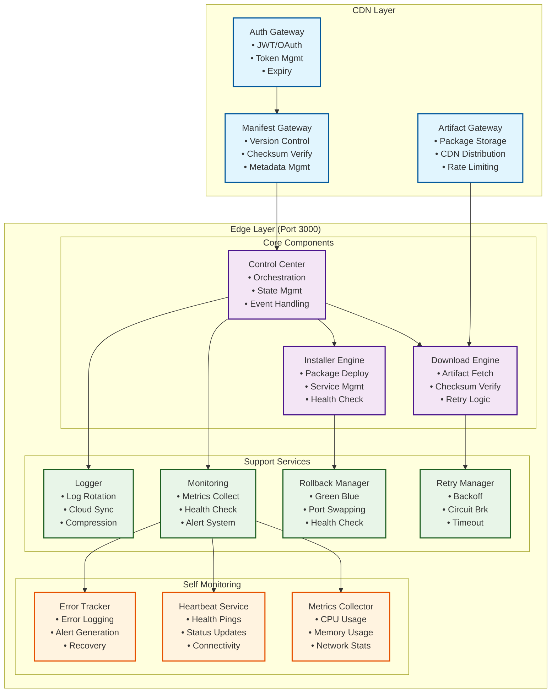
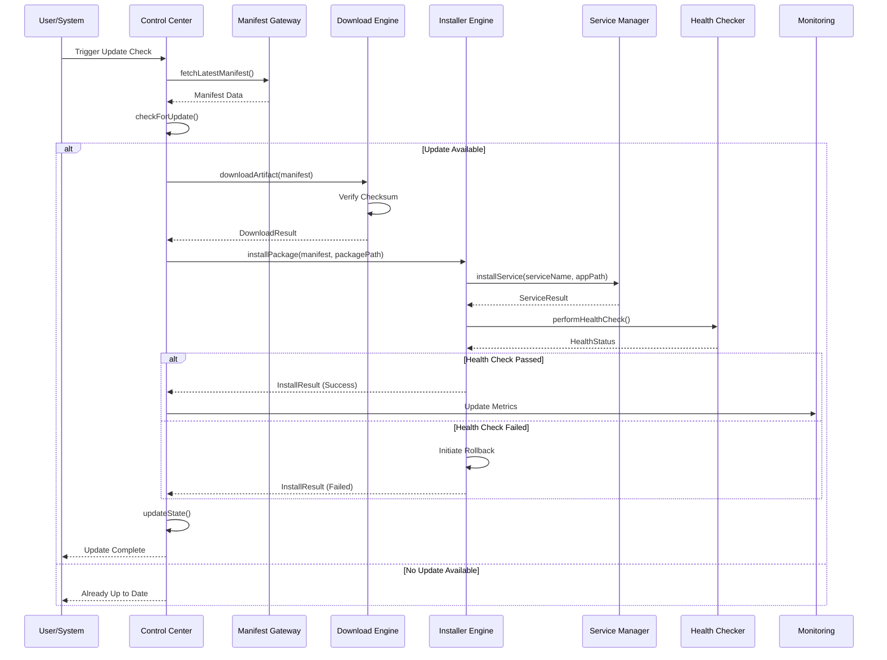
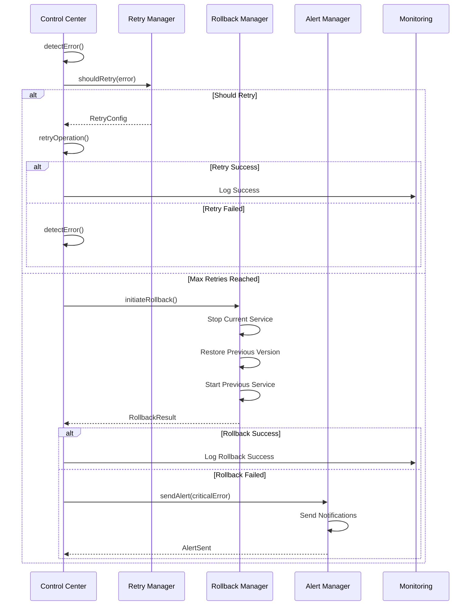
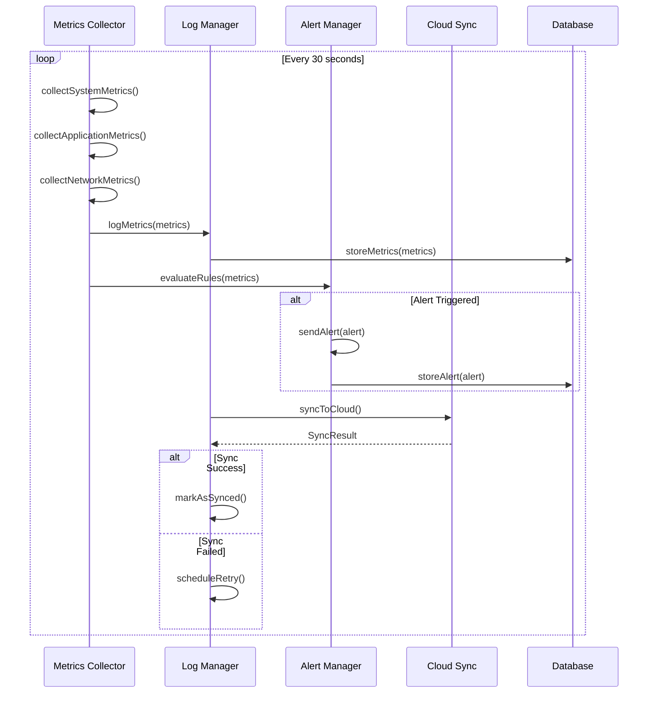
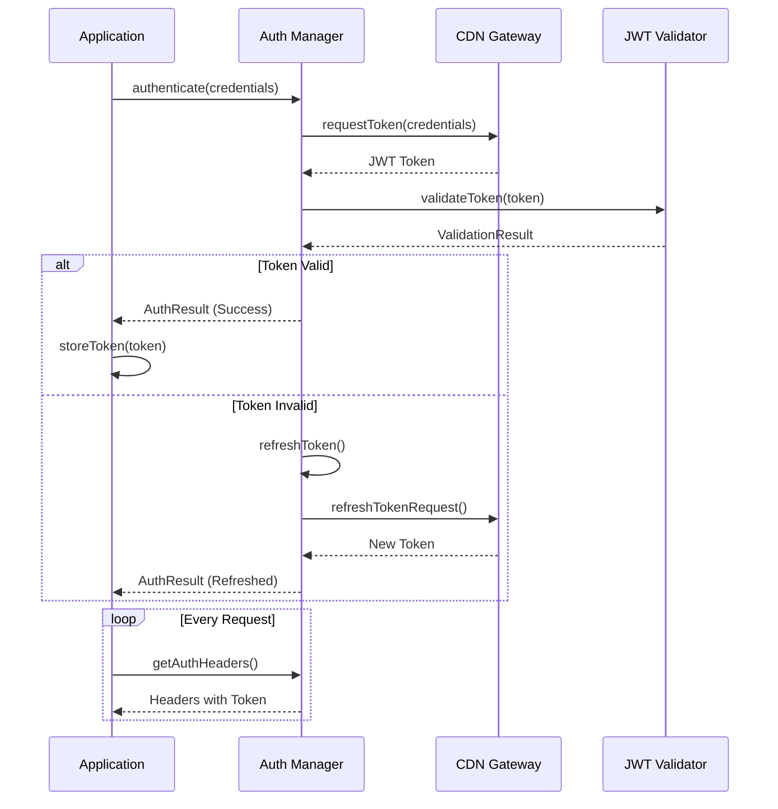
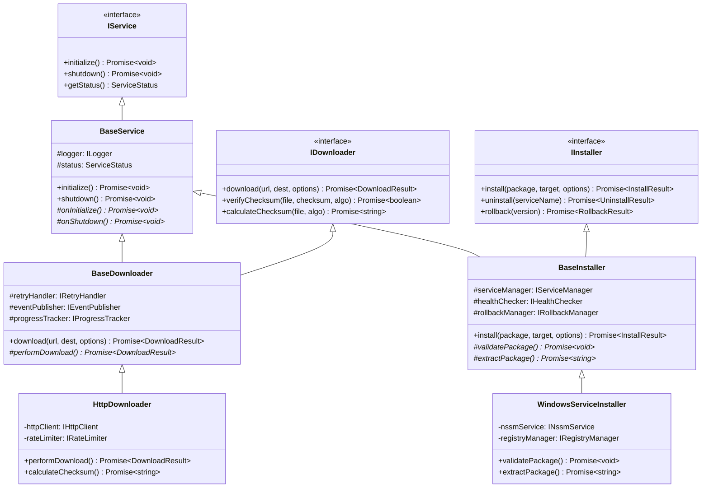
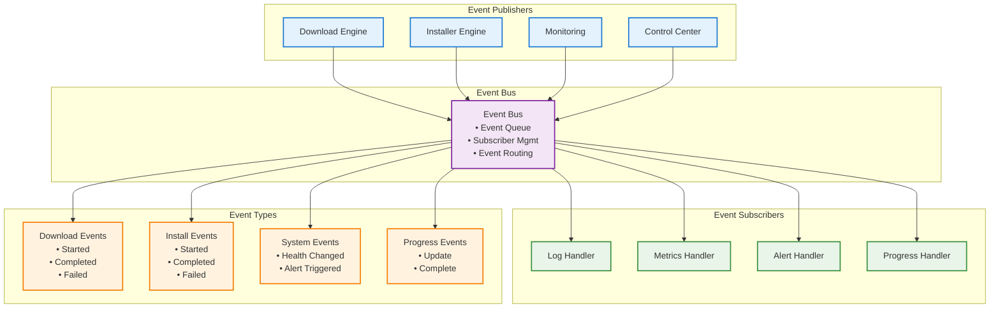
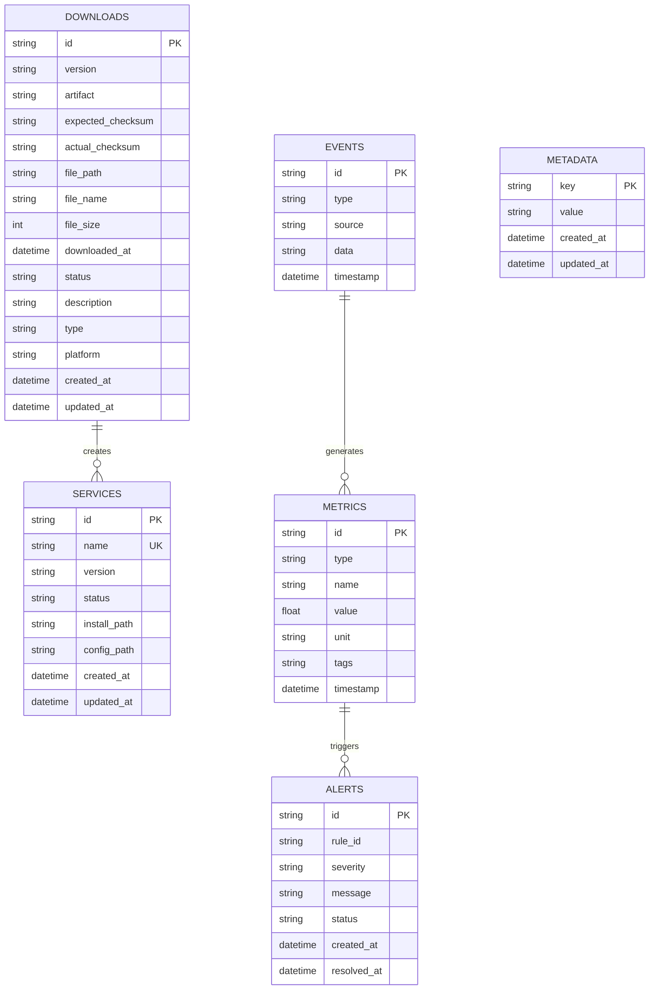
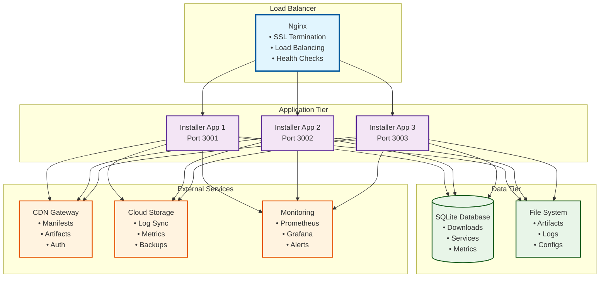

# 📊 Visual Diagrams - Installer Application

This document contains all the visual diagrams from the LLD in a format that can be easily viewed in any Markdown viewer.

## 🏗️ Architecture Overview

## 🔄 Main Update Flow

## 🚨 Error Recovery Flow

## 📊 Monitoring Flow

## 🔐 Authentication Flow

## 🏗️ Class Hierarchy

## 🔄 Event System Architecture

## 🗄️ Database Schema

## 🚀 Deployment Architecture

## 📱 Mobile/Web Dashboard View

```mermaid
graph TB
    subgraph "Frontend Dashboard"
        HEADER[Header<br/>• Logo<br/>• Navigation<br/>• User Menu]
        SIDEBAR[Sidebar<br/>• System Status<br/>• Quick Actions<br/>• Navigation]
        MAIN[Main Content]
    end
    
    subgraph "Dashboard Sections"
        OVERVIEW[Overview<br/>• System Health<br/>• Active Downloads<br/>• Recent Activity]
        DOWNLOADS[Downloads<br/>• Download History<br/>• Progress Tracking<br/>• Error Logs]
        INSTALLS[Installations<br/>• Service Status<br/>• Version History<br/>• Rollback Options]
        MONITORING[Monitoring<br/>• Real-time Metrics<br/>• Performance Charts<br/>• Alert History]
        SETTINGS[Settings<br/>• Configuration<br/>• User Management<br/>• System Preferences]
    end
    
    subgraph "Real-time Updates"
        WS[WebSocket<br/>• Live Updates<br/>• Progress Events<br/>• Status Changes]
        API[REST API<br/>• Data Fetching<br/>• CRUD Operations<br/>• Authentication]
    end
    
    HEADER --> MAIN
    SIDEBAR --> MAIN
    
    MAIN --> OVERVIEW
    MAIN --> DOWNLOADS
    MAIN --> INSTALLS
    MAIN --> MONITORING
    MAIN --> SETTINGS
    
    OVERVIEW --> WS
    DOWNLOADS --> WS
    INSTALLS --> WS
    MONITORING --> WS
    
    OVERVIEW --> API
    DOWNLOADS --> API
    INSTALLS --> API
    MONITORING --> API
    SETTINGS --> API
    
    classDef frontendClass fill:#e3f2fd,stroke:#1976d2,stroke-width:2px
    classDef sectionClass fill:#f3e5f5,stroke:#7b1fa2,stroke-width:2px
    classDef backendClass fill:#e8f5e8,stroke:#388e3c,stroke-width:2px
    
    class HEADER,SIDEBAR,MAIN frontendClass
    class OVERVIEW,DOWNLOADS,INSTALLS,MONITORING,SETTINGS sectionClass
    class WS,API backendClass
```

---

## 🎨 How to View These Diagrams

### 1. **GitHub/GitLab** (Recommended)
- Upload to a repository
- GitHub automatically renders Mermaid diagrams
- Best for professional presentation

### 2. **Online Mermaid Editors**
- **[Mermaid Live Editor](https://mermaid.live)** - Paste any diagram code
- **[Mermaid Chart](https://www.mermaidchart.com)** - Professional diagramming
- **[Draw.io](https://app.diagrams.net)** - Import Mermaid code

### 3. **VS Code Extensions**
- **Mermaid Preview** extension
- **Markdown Preview Enhanced** extension

### 4. **Browser Extensions**
- **Mermaid Preview** for Chrome/Firefox
- **Markdown Viewer** extensions

### 5. **Documentation Sites**
- **GitBook** - Supports Mermaid
- **Notion** - Supports Mermaid
- **Confluence** - With Mermaid plugin

---

**💡 Pro Tip**: Copy any diagram code and paste it into [Mermaid Live Editor](https://mermaid.live) for instant visualization!
