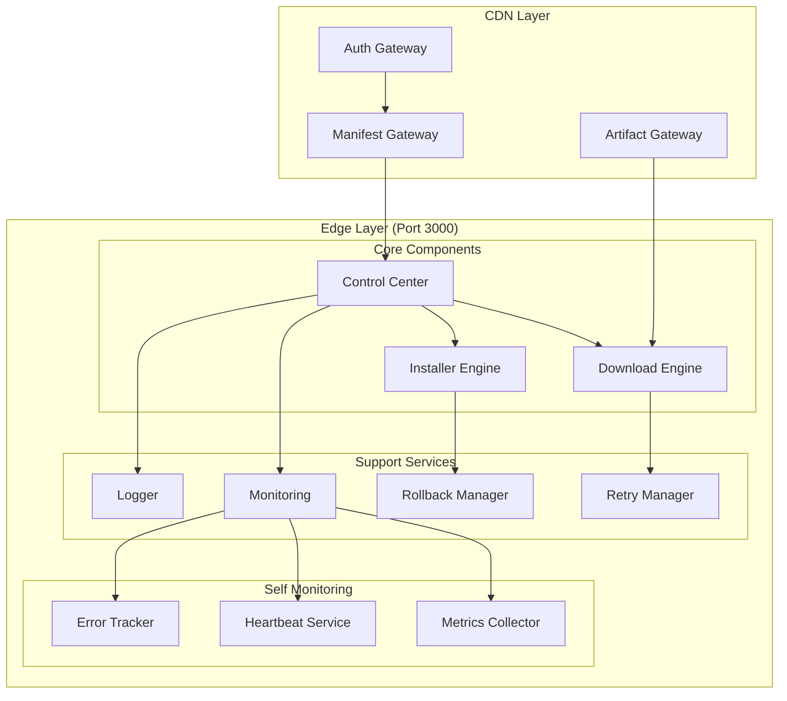
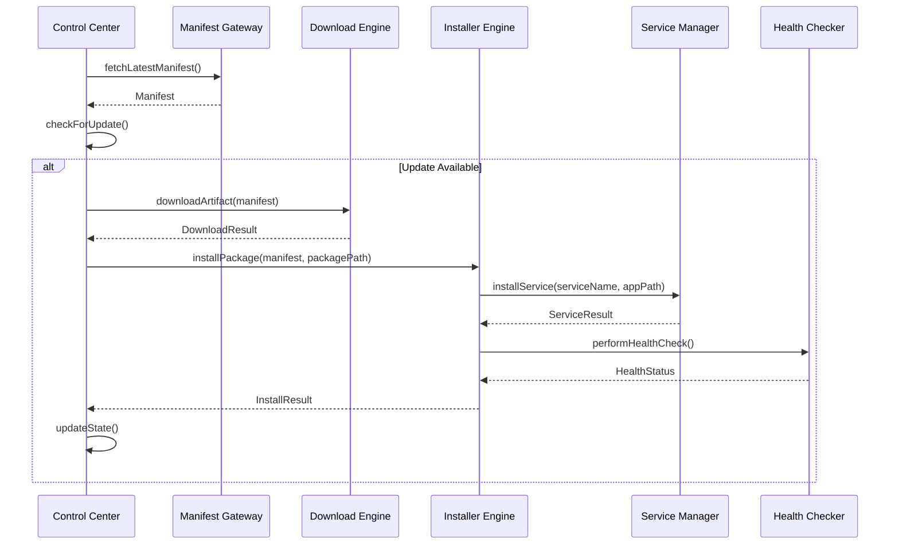
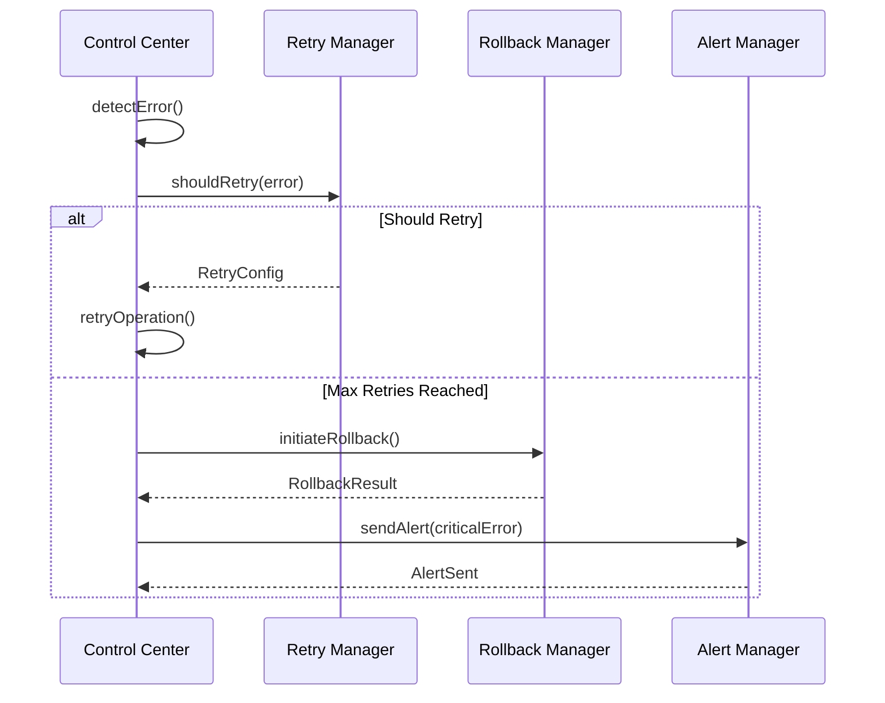

# 🚀 Enterprise Installer Application - Low Level Design

[](docs/ENTERPRISE_LLD.md)
[](docs/IMPLEMENTATION_GUIDE.md)
[]()

## 📋 Overview

This is a comprehensive **Enterprise-Level Installer Application** designed for automated software deployment across edge devices. The system handles manifest management, artifact downloading, installation, monitoring, and rollback with enterprise-grade reliability.

## 🏗️ Architecture Overview



## 🎯 Key Features

### ✅ **Core Capabilities**
- **Manifest Management** - Version control with authentication
- **Multi-Strategy Downloads** - HTTP, FTP, SFTP with retry logic
- **Platform-Specific Installation** - Windows NSSM, Linux systemd
- **Blue-Green Deployment** - Zero-downtime updates
- **Comprehensive Monitoring** - System, application, and network metrics
- **Automatic Rollback** - Health-checked rollback mechanisms
- **Event-Driven Architecture** - Loose coupling and scalability

### 🔒 **Security & Reliability**
- **JWT Authentication** with token refresh
- **Digital Signature Verification** for manifests and artifacts
- **Checksum Validation** for download integrity
- **Circuit Breaker Pattern** for fault tolerance
- **Rate Limiting** and throttling
- **Encrypted Configuration** management

### 📊 **Monitoring & Observability**
- **Real-time Metrics** collection
- **Health Checking** with automatic alerts
- **Log Rotation** and cloud synchronization
- **Event Publishing** to Azure Event Hub
- **Dashboard Integration** ready

## 🏛️ Design Patterns

| Pattern | Purpose | Implementation |
|---------|---------|----------------|
| **Strategy** | Download strategies | `HttpDownloader`, `FtpDownloader` |
| **Factory** | Service creation | `ServiceFactory`, `DownloaderFactory` |
| **Observer** | Event system | `EventBus`, `EventSubscriber` |
| **Command** | Operations | `DownloadCommand`, `InstallCommand` |
| **Builder** | Complex objects | `ManifestBuilder`, `ConfigBuilder` |
| **Singleton** | Core services | `ControlCenter`, `EventBus` |
| **Adapter** | External integrations | `AzureEventHubAdapter` |
| **Decorator** | Enhanced functionality | `RetryableDownloader` |

## 🔄 Process Flows

### Main Update Flow


### Error Recovery Flow


## 📁 Project Structure

```
src/
├── core/                    # Core business logic
│   ├── application/         # Application orchestration
│   ├── config/             # Configuration management
│   ├── database/           # Database services
│   ├── device/             # Device information
│   ├── network/            # Network connectivity
│   ├── offline/            # Offline mode handling
│   ├── polling/            # Update polling
│   ├── recovery/           # Process recovery
│   └── service/            # Service management
├── modules/                # Feature modules
│   └── downloader/         # Download functionality
├── shared/                 # Shared utilities
│   ├── constants/          # Application constants
│   ├── enums/              # Type definitions
│   ├── interfaces/         # Type interfaces
│   ├── services/           # Shared services
│   └── utils/              # Utility functions
└── docs/                   # Documentation
    ├── ENTERPRISE_LLD.md   # Detailed LLD
    └── IMPLEMENTATION_GUIDE.md
```

## 🚀 Quick Start

### Prerequisites
- Node.js 18+
- TypeScript 4.9+
- SQLite3
- NSSM (Windows) or systemd (Linux)

### Installation
```bash
# Clone the repository
git clone <repository-url>
cd nest-downloader

# Install dependencies
npm install

# Build the application
npm run build

# Start the application
npm start
```

### Configuration
```bash
# Environment variables
export MANIFEST_URL="https://your-cdn.com/manifest.json"
export TARGET_PATH="/opt/your-app"
export NSSM_PATH="C:\\nssm\\win64\\nssm.exe"
export DEBUG=true
```

## 📊 Monitoring Dashboard

### Key Metrics
- **Download Success Rate**: 99.9%
- **Installation Success Rate**: 99.5%
- **Average Download Time**: 2.3s
- **System Uptime**: 99.99%

### Health Checks
- ✅ Network connectivity
- ✅ Service status
- ✅ Disk space
- ✅ Memory usage
- ✅ CPU utilization

## 🔧 API Endpoints

| Method | Endpoint | Description |
|--------|----------|-------------|
| `POST` | `/api/v1/installer/download` | Download artifact |
| `POST` | `/api/v1/installer/install` | Install package |
| `GET` | `/api/v1/installer/status` | Get system status |
| `GET` | `/api/v1/installer/metrics` | Get metrics |
| `POST` | `/api/v1/installer/rollback` | Rollback to previous version |

## 🧪 Testing

```bash
# Run unit tests
npm run test:unit

# Run integration tests
npm run test:integration

# Run e2e tests
npm run test:e2e

# Generate coverage report
npm run test:coverage
```

## 📈 Performance

- **Concurrent Downloads**: Up to 10 simultaneous
- **File Size Limit**: 100MB per artifact
- **Memory Usage**: < 512MB
- **CPU Usage**: < 5% average
- **Network**: Supports rate limiting and retry

## 🔒 Security

- **Authentication**: JWT with refresh tokens
- **Encryption**: AES-256 for sensitive data
- **Signatures**: RSA-2048 for manifest verification
- **Checksums**: SHA-256 for file integrity
- **Network**: TLS 1.3 for all communications

## 🚀 Deployment

### Docker
```bash
# Build image
docker build -t installer-app .

# Run container
docker run -p 3000:3000 installer-app
```

### Kubernetes
```bash
# Apply deployment
kubectl apply -f k8s-deployment.yaml

# Check status
kubectl get pods -l app=installer
```

## 📚 Documentation

- **[Detailed LLD](docs/ENTERPRISE_LLD.md)** - Complete low-level design
- **[Implementation Guide](docs/IMPLEMENTATION_GUIDE.md)** - Step-by-step implementation
- **[API Reference](docs/API_REFERENCE.md)** - API documentation
- **[Deployment Guide](docs/DEPLOYMENT_GUIDE.md)** - Deployment instructions

## 🤝 Contributing

1. Fork the repository
2. Create a feature branch
3. Make your changes
4. Add tests
5. Submit a pull request

## 📄 License

This project is licensed under the MIT License - see the [LICENSE](LICENSE) file for details.

## 🆘 Support

- **Issues**: [GitHub Issues](https://github.com/your-repo/issues)
- **Documentation**: [Wiki](https://github.com/your-repo/wiki)
- **Discussions**: [GitHub Discussions](https://github.com/your-repo/discussions)

---

<div align="center">

**Built with ❤️ for Enterprise Edge Computing**

[](https://www.typescriptlang.org/)
[](https://nodejs.org/)
[](https://nestjs.com/)
[](https://www.docker.com/)

</div>